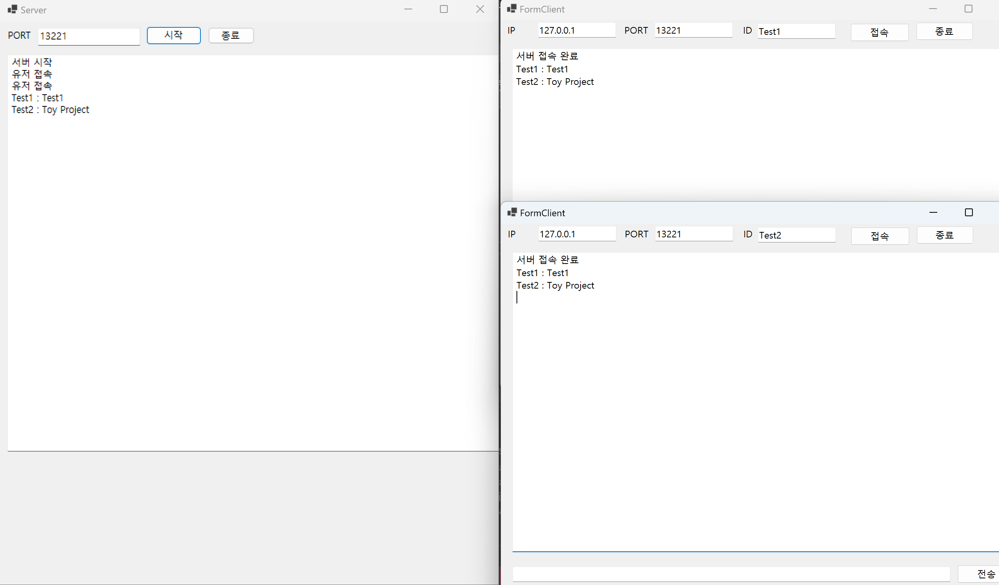

# 기본적인 서버-클라이언트 구조 및 동작 방식

## 소개
이 프로젝트는 **Windows Forms**를 활용하여 서버와 클라이언트 간의 기본적인 통신 구조 및 동작 방식을 학습하기 위한 기초 프로젝트입니다.  
서버와 클라이언트 간의 데이터 송수신 과정을 통해 네트워크 프로그래밍의 핵심 개념을 익히는 데 초점을 맞췄습니다.

---

## 기능
### 서버
- 클라이언트의 연결 요청 처리
- 클라이언트로부터 수신된 메시지 관리
- 다중 클라이언트 연결 지원

### 클라이언트
- 서버에 연결 및 메시지 전송
- 서버로부터의 응답 수신

---

## 구조
### 동작 원리
1. **서버**: 클라이언트의 연결 요청을 수락하고, 메시지를 송수신합니다.
2. **클라이언트**: 서버와 연결을 설정하고, 데이터를 주고받습니다.
3. **통신 프로토콜**: .NET을 기반으로 사용하여 안정적인 데이터 전송을 구현합니다.

---

## 사용 기술
- **언어**: C#
- **플랫폼**: Windows Forms
- **라이브러리**: .NET SocketAPI

## 동작 화면

### 서버 실행 화면

